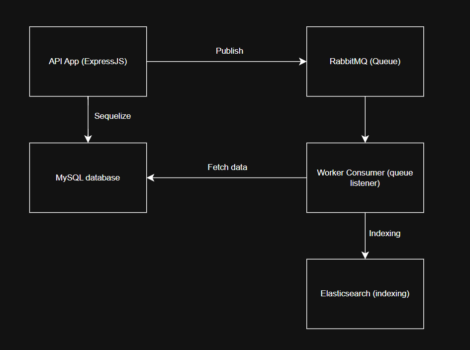

### 1. Cara clone repository

```
# clone repository
$ git clone https://github.com/chelseaoktaviany/news-management-system.git
```

#### 1.1 Cara menjalankan sebuah proyek

- Buka xampp kalau terinstall

```
# masuk ke folder project
$ cd news-management-system

# login ke mysql
$ mysql -u root -p

# buatkan database
$ CREATE DATABASE news_db;

# inisialisasi node_module
$ npm install

# jalankan seluruh service dalam docker
$ docker compose up --build
```

Setelah semua container berjalan:

- API -> http://localhost:3000
- RabbitMQ dashboard -> http://localhost:15672 (user: guest/pass: guest)
- Elasticsearch -> http://localhost:9200
- MySQL -> localhost:3306

Untuk menghentikan service:
`docker compose down`

### 2. Konfigurasi Environment (.env)

Ubah file `.env.sample` menjadi sebuah contoh bawah ini:

```
# MySQL
MYSQL_HOST=localhost
MYSQL_PORT=3306
MYSQL_USER=root
MYSQL_PASSWORD=
MYSQL_DB=news_db


# RabbitMQ
RABBITMQ_URL=amqp://localhost


# Elasticsearch
ELASTIC_URL=http://localhost:9200
ELASTIC_INDEX=news

# App
PORT=3000
NODE_ENV=development
```

Ganti nama file `.env.sample` menjadi `.env`

### 3. Penjelasan Arsitektur Singkat


Penjelasan:

- API Service menerima request, menyimpan berita ke MySQL lalu mengirim event indexing ke RabbitMQ.
- RabbitMQ menyimpan pesan dalam antrian `news_index_queue`.
- Worker Service mengambil pesan, memprosesnya, lalu mengirim data ke Elasticsearch.
- Elasticsearch menyediakan kemampuan search cepat setelah indexing
- Docker compose menjalankan seluruh service sekaligus

### 4. Cara menguji API dan Worker

#### 4.1 Test API (curl)

Insert berita baru

```
curl -X POST http://localhost:3000/api/news \
-H "Content-Type: application/json" \
-d '{
"title": "Berita Tes",
"content": "Ini adalah konten testing",
"author": "Tester",
"source": "Local",
"created_at": "2025-01-10 10:00:00"
}'
```

Jika berhasil:

- Data masuk ke MySQL
- API publish message ke RabbitMQ
- Worker menerima message dan mengindex ke Elasticsearch

Melihat semua berita

```
curl -X GET http://localhost:3000/api/news \
```

Jika berhasil:

- Semua berita sudah ditampilkan di terminal

Search sebuah berita

```
curl -X GET http://localhost:3000/api/search?q=Fajar \
```

Jika berhasil:

- Sebuah berita sudah ditampilkan di terminal
- Worker menerima message dan mengindex ke Elasticsearch

#### 4.2 Test RabbitMQ Worker

Cek log worker:
`docker logs -f news-worker`

Output yang benar:

```
[dotenv@17.2.3] injecting env (2) from .env -- tip: ⚙️  write to custom object with { processEnv: myObject }
Connecting to RabbitMQ at amqp://rabbitmq
Connected to RabbitMQ. Queue is ready: news_index_queue
Index exists: news_index
Worker starter, listening for index jobs
Worker received job: {
  id: 20,
  title: 'Harga Beras Naik 12% Akibat Gangguan Distribusi',
  content: 'Kenaikan harga beras akibat gangguan distribusi dan menurunnya pasokan selama dua minggu terakhir.',
  author: 'Putri Wulandari',
  source: 'EkonomiID',
  created_at: '2025-01-25T09:05:00.000Z'
}
Worker received job: {
  id: 19,
  title: 'Timnas Indonesia Lolos ke Final Piala Asia U-23',
  content: 'Timnas Indonesia U-23 melaju ke final setelah mengalahkan lawan berat dalam pertandingan dramatis.',
  author: 'Rian Mahardika',
  source: 'SportZone',
  created_at: '2025-02-01T20:30:00.000Z'
}
Worker received job: {
  id: 18,
  title: 'Cuaca Ekstrem Diprediksi Melanda Sejumlah Wilayah di Indonesia',
  content: 'BMKG memperingatkan potensi cuaca ekstrem termasuk hujan deras dan angin kencang dalam beberapa hari ke depan.',
  author: 'Sari Kurnia',
  source: 'BMKG News',
  created_at: '2025-01-27T15:10:00.000Z'
}
Worker received job: {
  id: 17,
  title: 'Startup Lokal Raih Pendanaan Seri B Senilai 150 Miliar Rupiah',
  content: 'Startup teknologi lokal mendapatkan pendanaan seri B untuk memperluas layanan dan mengembangkan teknologi AI.',
  author: 'Andi Pratama',
  source: 'TechDaily',
  created_at: '2025-02-03T10:21:00.000Z'
}
```

#### 4.3 Test Elasticsearch Search

`curl -X GET "http://localhost:9200/news_index/_search?pretty"`

Jika worker berjalan benar, hasil berita yang di-index akan muncul.
